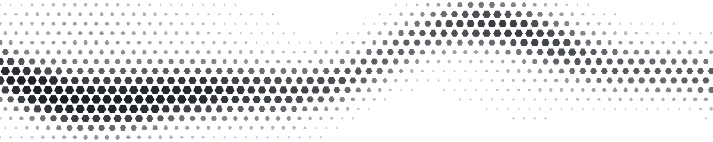

<!-- Perfil oficial da Hence. -->

<a href="https://hence.pt/pt/">
  <picture>
    <source media="(prefers-color-scheme: dark)" srcset="./assets/visual/hence-flow-dark.gif">
    <source media="(prefers-color-scheme: light)" srcset="./assets/visual/hence-flow-light.gif">
    
  </picture>
</a>

  <a href="https://hence.pt/pt/">
    <picture>
      <source media="(prefers-color-scheme: dark)" srcset="./assets/brand/hence-horizontal-principal.svg">
      <source media="(prefers-color-scheme: light)" srcset="./assets/brand/hence-horizontal-reverso.svg">
      
    </picture>
  </a>

  <h1>Ideias transformadas em realidade.</h1>

  

    Laboratório criativo e grupo tecnológico em construção. 
    Design, desenvolvimento e sistemas para experiências digitais com propósito.
  

  

    
    
    
  

<h2 align="center">Onde criamos</h2>

  
  
  
  
  

<h2 align="center">Tecnologia e ferramentas</h2>

  <picture>
    <source media="(prefers-color-scheme: dark)" srcset="https://skillicons.dev/icons?i=html%2Ccss%2Csass%2Cjs%2Cts%2Creact%2Cnextjs%2Cvite%2Cbun%2Cthreejs%2Cfigma%2Cps%2Cai%2Cae%2Cpr%2Cpython%2Cpowershell%2Cgithubactions%2Clinux%2Cdocker%2Cgit&amp;theme=dark&amp;perline=11">
    <source media="(prefers-color-scheme: light)" srcset="https://skillicons.dev/icons?i=html%2Ccss%2Csass%2Cjs%2Cts%2Creact%2Cnextjs%2Cvite%2Cbun%2Cthreejs%2Cfigma%2Cps%2Cai%2Cae%2Cpr%2Cpython%2Cpowershell%2Cgithubactions%2Clinux%2Cdocker%2Cgit&amp;theme=light&amp;perline=11">
    
  </picture>

<strong>Ver stack completa</strong>

<strong>Front-end</strong> 
HTML · CSS · SCSS · JavaScript · TypeScript · React · Next.js · Vite · Bun · GSAP · Three.js

<strong>Design e movimento</strong> 
Figma · Spline · Photoshop · Illustrator · After Effects · Premiere Pro

<strong>IA e automação</strong> 
ChatGPT · Codex · Python · PowerShell · Shell · GitHub Actions

<strong>Sistemas</strong> 
Linux · Docker · Docker Compose · systemd · Caddy · Tailscale · Borg · Git

---

  <h2>Vamos construir algo?</h2>
  
Novas ideias, colaborações e trabalho selecionado.

  

    
    
  

  Lisboa, Portugal · Em construção

